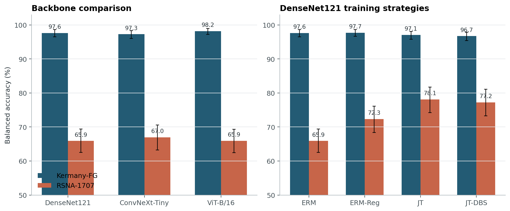

# CXRShift

[](https://github.com/JasonGao1010/CXRShift/actions/workflows/ci.yml)
[](https://github.com/JasonGao1010/CXRShift/releases)
[](LICENSE)

**An evidence-backed study of cross-source robustness in chest X-ray
classification.** Across three ImageNet-pretrained backbones and three random
seeds, balanced accuracy decreases from **97.27–98.17%** on Kermany-FG to
**65.91–66.95%** on RSNA-1707. Within this protocol, none of the tested
backbones eliminated the source-associated performance gap.



Error bars show 95% grouped-bootstrap intervals for the absolute balanced
accuracy of each ensemble.

## Study design

CXRShift evaluates DenseNet121, ConvNeXt-Tiny, and ViT-B/16 under a fixed
protocol:

- three training seeds (42, 43, and 44) per model and training strategy;
- probability-level ensembling before metric computation;
- a decision threshold fixed at 0.5 for the primary operating-point metrics;
- filename-grouped resampling for Kermany-FG and `patientId`-grouped resampling
  for RSNA-1707;
- 5,000-iteration grouped bootstrap intervals and paired comparisons on
  identical resamples.

The repository contains the split manifests, 36 per-image prediction files,
the numerical summary, and the analysis code needed to reproduce the reported
statistics from those predictions. Raw medical images and model checkpoints
are not redistributed.

## Results

The primary table is computed from the mean positive-class probability across
the three seeds.

| Backbone | Kermany-FG balanced accuracy | RSNA-1707 balanced accuracy | RSNA-1707 specificity |
|---|---:|---:|---:|
| DenseNet121 | 97.65% | 65.91% | 35.35% |
| ConvNeXt-Tiny | 97.27% | 66.95% | 41.40% |
| ViT-B/16 | 98.17% | 65.94% | 36.28% |

The RSNA error profile is asymmetric: all three models retain high sensitivity
while producing substantially more false positives. Training interventions
alter this trade-off:

| DenseNet121 strategy | RSNA-1707 balanced accuracy | Change from ERM (95% grouped CI) |
|---|---:|---:|
| ERM | 65.91% | — |
| ERM-Reg | 72.33% | +6.41 pp (+3.47, +9.41) |
| Joint training (JT) | 78.13% | +12.22 pp (+8.02, +16.38) |
| JT with source-balanced sampling (JT-DBS) | 77.22% | +11.31 pp (+7.00, +15.68) |

JT and JT-DBS use RSNA training and validation labels. They measure adaptation
to a known source, not zero-shot generalization to an unseen institution.

The complete machine-readable result is
[`results/CXRShift__main-summary.json`](results/CXRShift__main-summary.json).

## What the evidence supports

- The cross-source gap is consistent across DenseNet121, ConvNeXt-Tiny, and
  ViT-B/16, so backbone substitution alone is not supported as a remedy.
- Joint training increases RSNA-1707 balanced accuracy, but it uses labels from
  that source and therefore measures known-source adaptation rather than
  unseen-site generalization.
- A separate raw-image diagnostic uses simple image statistics to distinguish
  sources and reaches **0.944 AUROC** under label-matched grouped
  cross-validation
  ([result](results/domain_shift_diagnostic.json),
  [analysis](scripts/analyze_domain_shift.py)). This descriptive diagnostic
  shows that source remains readily identifiable after matching label counts;
  it does not identify the causal mechanism of the performance gap.
- Grouped confidence intervals and paired strategy comparisons are recomputed
  from per-image probabilities, with filename clusters used for Kermany-FG and
  `patientId` used for RSNA-1707.

These findings are consistent with earlier reports that chest X-ray models can
lose performance across institutions or exploit source-specific signals. See
[Zech et al. (2018)](https://journals.plos.org/plosmedicine/article?id=10.1371/journal.pmed.1002683),
[Cohen et al. (2020)](https://proceedings.mlr.press/v121/cohen20a.html), and
[DeGrave et al. (2021)](https://www.nature.com/articles/s42256-021-00338-7).
CXRShift contributes a compact prediction-level audit and an explicit
raw-data rebuild path; it does not propose a new domain-generalization model.

## Reproduce the reported statistics

The lightweight verification path does not require either image dataset:

```bash
python -m venv .venv
source .venv/bin/activate
python -m pip install --upgrade pip
python -m pip install -r requirements.txt
python -m pytest -q
python scripts/check_protocol.py
python scripts/summarize_results.py \
  --results-dir results \
  --output-json rebuild/CXRShift__main-summary.json \
  --output-csv rebuild/CXRShift__main-summary.csv \
  --require-complete
```

This path has been executed against the committed prediction files and is
deterministic. The repository also implements a raw-data-to-prediction rebuild:

```bash
python scripts/reproduce_all.py --dry-run --stage all
python scripts/reproduce_all.py --stage all --device cuda
```

The full command reconstructs the prepared datasets, trains 18 model instances,
and evaluates each on both test sets. It has **not** been independently executed
end to end for this release, so the repository does not claim that a clean
raw-data rebuild has reproduced the committed predictions. See
[`REPRODUCIBILITY.md`](REPRODUCIBILITY.md) for the precise evidence boundary,
data layout, experiment matrix, and comparison criteria.

## Interpretation

- Kermany-FG uses conservative filename clusters because the public package
  does not provide a verified patient table. It must not be described as a
  patient-disjoint cohort.
- RSNA-1707 is a fixed, near-balanced audit subset and its test partition was
  used for exploratory model and strategy comparisons. It is not a
  prevalence-representative clinical cohort or an untouched confirmation set.
- Kermany directory labels and RSNA challenge targets differ in population,
  acquisition process, and label construction. The measured gap is therefore a
  cross-source stress result, not a causal estimate of any single mechanism.
- This repository supports research evaluation only and is not intended for
  clinical decision-making.

Dataset provenance, attribution, and exact split semantics are documented in
[`data/README.md`](data/README.md).

## Repository structure

```text
configs/        Model and training configurations
data/splits/    Frozen membership and integrity manifests
figures/        Aggregate result figure; no medical images
protocol/       Canonical experiment identities
results/        Main summary and per-image prediction evidence
scripts/        Data preparation, training, evaluation, and analysis
src/            Shared dataset and protocol utilities
tests/          Focused semantic and numerical checks
```

## Authorship and license

Jinze Gao designed the study and implemented the data, training, evaluation,
statistical-analysis, and reproducibility pipelines.

The MIT license covers the original code only. Dataset manifests and prediction
artifacts retain the source datasets' terms; see
[`DATA_LICENSE.md`](DATA_LICENSE.md). If you use the software or reported
evidence, please cite the metadata in [`CITATION.cff`](CITATION.cff).
